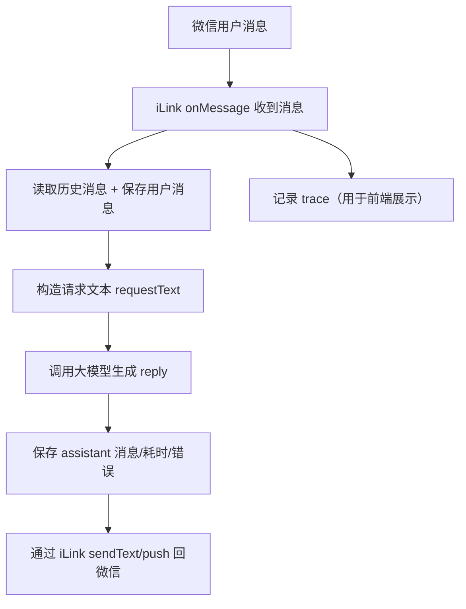

## 1. 产品概述
用于在浏览器中可视化查看 iLink（微信侧）与大模型（Spring AI/OpenAI 兼容接口）之间的关键入参/出参，便于调试对话链路与排查问题。
- 目标用户：本项目开发/运维人员
- 核心价值：快速定位“用户消息 → 构造 Prompt → 模型回复/异常 → 发送回微信”的每一步数据

## 2. 核心功能

### 2.1 功能模块
1. **追踪列表页**：展示最近 N 条对话追踪记录，支持自动刷新
2. **追踪详情抽屉/面板**：查看单条记录的结构化字段与原始文本

### 2.2 页面明细
| 页面名称 | 模块名称 | 功能说明 |
|---|---|---|
| 追踪列表 | 顶部控制栏 | 自动刷新开关、刷新间隔、按 sessionId 过滤、按关键字过滤 |
| 追踪列表 | 列表表格 | 时间、sessionId、contextToken、模型、耗时、状态（成功/失败） |
| 追踪详情 | 详情面板 | userText、requestText（拼接后的请求）、replyText、errorMsg、原始 JSON |

## 3. 核心流程
用户向 clawbot 发送消息后，系统记录并展示一次“对话追踪”的数据流。

## 4. 用户界面设计

### 4.1 设计风格
- 主题：深色调“观测台/控制台”风格
- 信息层级：列表高密度、详情可展开、错误高亮
- 字体：等宽为主，便于查看 prompt 与 JSON

### 4.2 页面设计概览
| 页面名称 | 模块名称 | UI 元素 |
|---|---|---|
| 追踪列表 | 顶部控制栏 | 输入框、切换开关、按钮、状态点 |
| 追踪列表 | 表格 | 固定表头、可点击行、hover 高亮 |
| 追踪详情 | 详情面板 | 代码块、复制按钮、折叠区域 |

### 4.3 响应式
- 桌面优先
- 窄屏时列表变为卡片，详情面板改为整页展开
