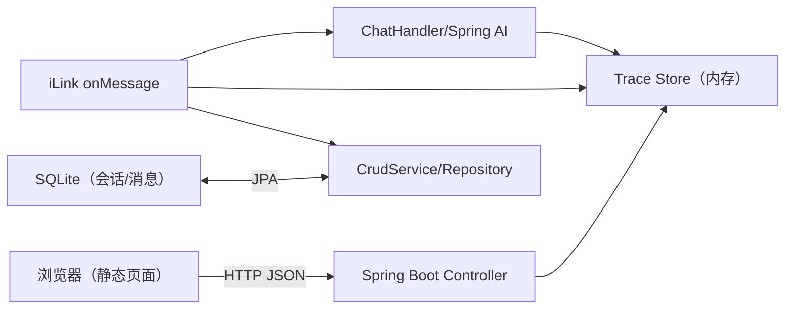
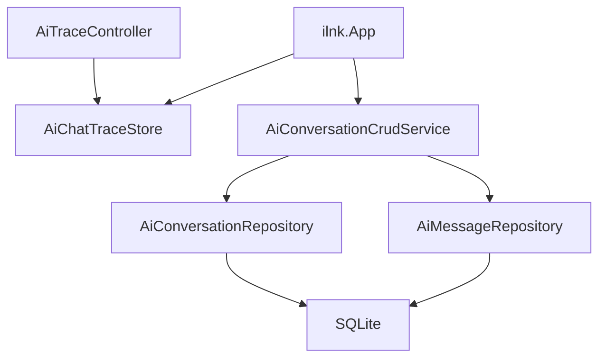

## 1. 架构设计



## 2. 技术说明
- 前端：Spring Boot 静态资源（`src/main/resources/static`） + 原生 HTML/CSS/JS（无额外构建工具）
- 后端：Spring Boot 4.1 + Spring Web + Spring Data JPA
- 数据：
  - SQLite：持久化保存会话与消息（AiConversation/AiMessage）
  - 内存 Trace Store：保存最近 N 条 iLink↔LLM 的“链路追踪”记录（用于实时观测）
- 外部服务：
  - iLink SDK：监听微信消息、发送回复
  - 大模型：Spring AI（OpenAI 兼容接口）

## 3. 路由定义
| 路由 | 用途 |
|---|---|
| /ai-trace.html | 追踪页面 |

## 4. API 定义
### 4.1 获取追踪列表
- `GET /api/ai/traces`
- Response:
```json
[
  {
    "timestamp": "2026-07-07T12:00:00+08:00",
    "sessionId": "wxid_xxx",
    "contextToken": "ct_xxx",
    "model": "ep-xxxx",
    "userText": "你好",
    "requestText": "（拼接后的请求文本）",
    "replyText": "（模型回复）",
    "responseTimeMs": 1234,
    "errorMsg": null
  }
]
```

## 5. 服务端架构图


